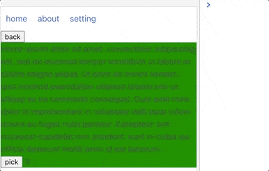

# svelte-cached-router
A svelte router that could cache the page component and works locally
base on [page.js](https://github.com/visionmedia/page.js) for route and [animejs](https://github.com/juliangarnier/anime/) for animation.

## screenshot




1. create a `routes.js` to define the routes

```javascript

    // transitions: noAnimation, fade, parallax
    
    export var routes = {
        '/': {
            component: Home,
            props: {                        // component with props, use default transition

            }
        },
        '/about/:something': {              // something's value use when component create, props
            component: About,
            keepFresh: true,                // recreate everytime
            transition: {                   // transition with props
                type: 'fade',
                params: {
                    scale: 1,
                    duration: 1000
                }
            }
        },
        '/setting': {
            component: Setting,
            transition: 'parallax'          // transition name directly
        }
    }
```


2. create `Router` component instance

```svelte
<!-- create Router instance and set default transition -->
<Router {routes} transition='parallax' />
```

## page component's props and callback functions

page can be any svelte component, and has some *OPTIONAL* special properties and callback functions.

The page component will cached by default, if you don't want cache the page you can define a property `keepFresh = true` then the page will recreate verytime

#### optional properties and callbacks:

* props:
    - keepFresh:  default is false
* callbacks:
    - preShow
    - preHide
    - shown
    - hidden

## page component exmaple

*Home.svelte* : the home page component

```javascript
<div>This is a normal svelte component</div>
<script>

    // this component cache or not
    // true: DO NOT CAHCE THIS PAGE COMPONENT
    export let keepFresh = true;

    export function preShow() {
        console.log('Home page is preShow');
    }

    export function shown() {
        console.log('Home page is shown');
    }

    export function preHide() {
        console.log('Home page is preHide');
    }

    export function hidden() {
        console.log('Home page is hidden')
    }
</script>
```

## access Page.js instance

You can use any `page.js` funcitions: `router.navigate`


```svelte
<Router bind:this={router} {routes} />

<script>
    onMount(() => {
        ...
        // router.navigate = page.js
        router.navigate.show('/abut');
        router.navigate.redirect('/setting')
        ...
    })
</script>

```

## Page transitions

There are three default transitions buildin. `fade`, `parallax` and `noAnimation` default is `parallax`

